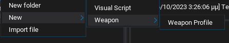
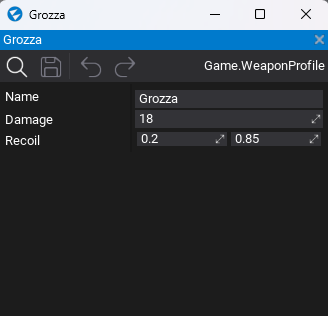
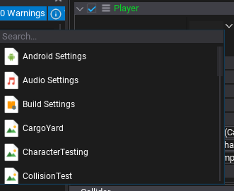
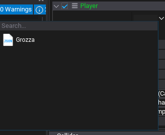

While developing your game, you might decide it would be awesome if you could create your own data files within the editor. That way, instead of storing the stats of your weapon in your `Weapon` class, you could create multiple data files that hold the information and change them whenever you feel like.
This is what JsonAssets where designed for. JsonAssets are very similiar to Unity `ScriptableGameObject`s. 

To start enjoying JsonAssets you first need to create a new C# class, which will be used as a template:
```cs
[ContentContextMenu("New/Weapons/Weapon Profile")]
public class WeaponProfile
{
    public string Name {get; set;}
    public int Damage {get; set;}
    public Vector2 Recoil {get; set;}
}
```

This is a simple version of what could be a `WeaponProfile` class that holds stats about your weapons. Once it is created, you can create a new Weapon Profile from the context menu:


This nice little shortcut is enabled by the `ContentContextMenu` attribute, which allows you to specify a path, from which you can create new JsonAssets of your class.

Now, we can edit our asset:


## But what are JsonAssets?

JsonAssets are exactly what they sound like, a json file with your serialized data. In fact, here is exactly what they look like:
```json
{
	"ID": "739d89e3459c22c5dadfaf9ce0379a94",
	"TypeName": "Game.WeaponProfile",
	"EngineBuild": 6401,
	"Data": {
        "Name": "Grozza",
        "Damage": 18,
        "Recoil": {
            "X": 0.2,
            "Y": 0.85
        }
    }
}
```
The `ID`, `TypeName` and `EngineBuild` are used by Flax so it knows which class the data corresponds to but the rest of the fields match exactly our class. You can further customize which fields will be serialized by using the [Serialize](https://docs.flaxengine.com/api/FlaxEngine.SerializeAttribute.html) and [NoSerialize](https://docs.flaxengine.com/api/FlaxEngine.NoSerializeAttribute.html) attributes.

## Using them

Ok, now that we have created our Weapon Profile, how do we use it? First off, we need to expose a field/property of type `JsonAsset`:
```cs
public class WeaponController
{
    [AssetReference(typeof(WeaponProfile))]
    public JsonAsset weaponProfile;
    ...
}
```

Now we can drag 'n drop our Grozza profile asset to our weapon controller. Because the JsonAsset type does not limit what kind of reference we can set to the `WeaponProfile` property, we can use tha [AssetReference](https://docs.flaxengine.com/api/FlaxEngine.AssetReferenceAttribute.html) attribute, which only allows JsonAssets of a give type to be set, in this case `WeaponProfile`.

Without the `AssetReference` attribute:

*Yes, game settings are JsonAssets too!*

With:


The only thing left, is to finally get the sweet, sweet data!
```cs
public void DoDamage(IDamageable damageable)
{
    ...
    var profile = weaponProfile.Instance as WeaponProfile;
    damageable.TakeDamage(profile.Damage);
    ...
}
```

As you can see there is a bit of typing before we get to the data. Our `weaponProfile` field is of type `JsonAsset`, which among other things, holds information not just about the asset we set in the editor but also information about what class is being used to create the asset and how to create new instances. The actual asset we set on the editor, is stored on the `Instance` property but because the JsonAsset doesn't want to deal with generics[^1] the type of it is `object` so we have to cast it.

[^1]: Because Flax supports mixing C++/C#, the class being used to create the asset can be in either C++ or C# and the class that ends up using it can also be in either C++ or C#. As such, generics cannot be used since they differ between languages and the best alternative is casting. 